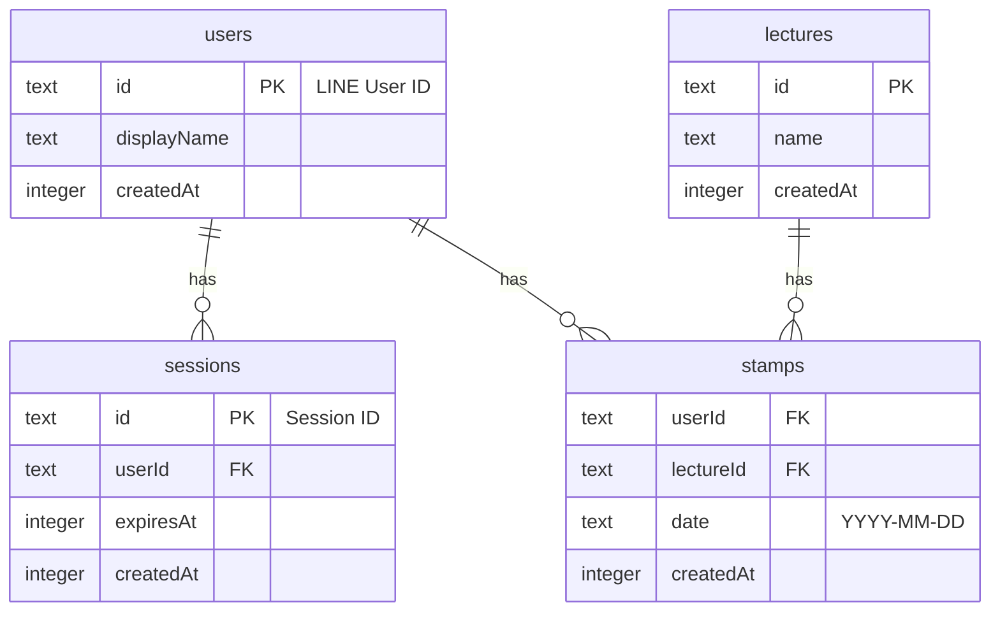

# プロジェクト概要

このドキュメントは、AIエージェントがこのプロジェクトの概要を理解し、開発を円滑に進めるためのガイドです。

## 1. アーキテクチャ

このアプリケーションは、クリーンアーキテクチャの考え方を取り入れた、サーバーサイド中心のアーキテクチャを採用しています。UIの動的な部分は、アイランドアーキテクチャの哲学に沿って、必要最小限のクライアントサイドJavaScriptで実現されます。

- **サーバー**: Node.js上で動作するHonoアプリケーションです。
- **認証**: **LINEログイン** を利用したOAuth 2.0フローを実装しています。CSRF対策（stateのワンタイム利用）も施されています。
- **セッション管理**: セッションはデータベースに永続化され、セキュリティと堅牢性を確保しています。手動ログアウト用のルート (`/logout`) と、クライアントサイドでの20秒タイマーによる自動ログアウト機能が実装されています。
- **永続化**: **Drizzle ORM** を介して **SQLite** データベースを操作し、`users`, `sessions`, `lectures`, `stamps` の情報を永続化します。
- **エラーハンドリング**: ログイン失敗時など、クリティカルなエラーが発生した際には、専用のエラーページを表示し、ユーザーに分かりやすいフィードバックを提供します。
- **レンダリング**: サーバーサイドレンダリング (SSR) が基本です。HonoのJSXエンジンがUIコンポーネントをHTMLに変換してクライアントに送信します。
- **動的更新**: HTMXを利用してフォーム送信などを処理し、サーバーからのリダイレクト指示に従います。

## 2. データベーススキーマ (ER図)

データベースは以下の4つのテーブルで構成されています。



## 3. 技術スタック

- **フレームワーク**: [Hono](https://hono.dev/)
- **ビュー (UI)**: [Hono/JSX](https://hono.dev/guides/jsx)
- **クライアントサイド**: [htmx](https://htmx.org/), 極小のVanilla JS
- **ORM**: [Drizzle ORM](https://orm.drizzle.team/)
- **データベース**: [better-sqlite3](https://github.com/WiseLibs/better-sqlite3) (SQLite)
- **LINE連携**: 標準`fetch` APIを利用
- **環境変数管理**: [dotenv](https://github.com/motdotla/dotenv)
- **実行環境**: [Node.js](https://nodejs.org/)
- **ビルド/実行ツール**: [tsx](https://github.com/esbuild-kit/tsx)
- **マイグレーション**: [drizzle-kit](https://orm.drizzle.team/kit/overview)

## 4. セットアップ

開発を開始する前に、プロジェクトのルートディレクトリに `.env` ファイルを作成し、以下の環境変数を設定する必要があります。

```env
# .env

# LINE Login Credentials
# LINE Developers Consoleから取得した実際の認証情報に置き換えてください
LINE_CHANNEL_ID="my-channel-id"
LINE_CHANNEL_SECRET="my-channel-secret"
LINE_CALLBACK_URL="http://localhost:3000/auth/line/callback"

# Session secret for signing cookies.
# WARNING: The default secret is insecure and MUST be replaced for production.
# A weak secret makes the application vulnerable to session hijacking attacks.
# Generate a strong secret with a command like:
# node -e "console.log(require('crypto').randomBytes(32).toString('hex'))"
SESSION_SECRET="replace-this-with-a-long-random-string"

# Database file path for Drizzle
DATABASE_URL="./data.db"
```

## 5. ゴール

このプロジェクトの主なゴールは、以下の通りです。

- **クリーンアーキテクチャの遵守**: 関心事の分離（ドメイン、インフラ、Web）を徹底し、保守性とテスト容易性の高いコードベースを構築すること。
- **セキュリティと堅牢性**: 安全な認証フロー、永続的なセッション管理、適切なエラーハンドリングを通じて、信頼性の高いアプリケーションを構築すること。
- **外部サービス連携**: LINEログインのような外部の認証サービスとスムーズに連携する機能を実装すること。
- **高い生産性**: サーバーサイドのロジックとビューを同じ言語（TypeScript/JSX）で記述し、Drizzle ORMによる型安全なデータベースアクセスを実現すること。
- **優れたパフォーマンス**: ページ全体の再読み込みを避け、htmxによる部分更新やリダイレクトを効果的に活用すること。
